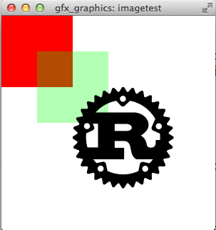
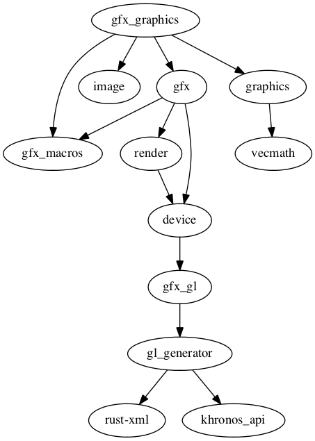

# gfx_graphics 

Maintainers: @Potpourri, @kvark, @bvssvni

The implementation of a piston-graphics back-end using Gfx.

[API Documentation](https://docs.rs/piston2d-gfx_graphics/)

### Dependency graph

[How to contribute](https://github.com/PistonDevelopers/piston/blob/master/CONTRIBUTING.md)
