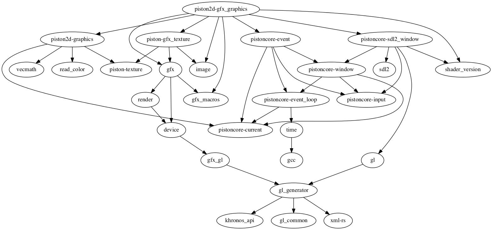

# gfx_graphics [](https://travis-ci.org/PistonDevelopers/gfx_graphics)

The implementation of a piston-graphics back-end using Gfx.

This is how it looks like:

```Rust
let mut g2d = G2D::new(&mut device);
for e in EventIterator::new(&mut window, &event_settings) {
    use piston::event::RenderEvent;
    e.render(|_| {
        g2d.draw(&mut renderer, &frame, |c, g| {
            c.rgb(1.0, 1.0, 1.0).draw(g);
            c.rect(0.0, 0.0, 100.0, 100.0).rgb(1.0, 0.0, 0.0).draw(g);
            c.rect(50.0, 50.0, 100.0, 100.0).rgba(0.0, 1.0, 0.0, 0.3).draw(g);
            c.trans(100.0, 100.0).image(&image).draw(g);
        });

        device.submit(renderer.as_buffer());
        renderer.reset();
   });
}
```

### Dependency graph


